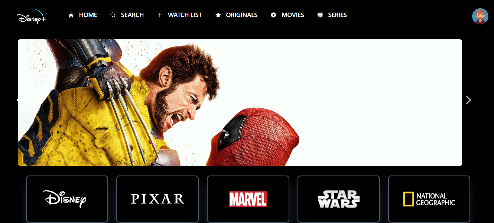

<h1>Disney Clone Project 🎬✨</h1>

This repository contains the source code for my Disney Clone project, built using <strong>React.js</strong>, <strong>Vite</strong>, and <strong>Tailwind CSS</strong>.

<h2>Description 📜</h2>

  This project is a clone of the Disney+ interface, showcasing various features and functionalities similar to the original platform.

<h2>Features 🌟</h2>
<ul>
  <li><strong>Home:</strong> A welcoming section introducing various Disney characters and movies.</li>
  <li><strong>Search:</strong> A search functionality to find specific movies or shows.</li>
  <li><strong>Watch List:</strong> A section to save favorite movies.</li>
  <li><strong>Originals:</strong> Showcases Disney's original content.</li>
  <li><strong>Movies:</strong> A list of available movies.</li>
  <li><strong>Series:</strong> A list of available series.</li>
</ul>

<h2>Technologies Used 🛠️</h2>
<ul>
  <li><strong>React:</strong> JavaScript library for building user interfaces.</li>
  <li><strong>Vite:</strong> Build tool that provides a fast development environment.</li>
  <li><strong>Tailwind CSS:</strong> Utility-first CSS framework for styling.</li>
  <li><strong>JavaScript:</strong> Programming language used for interactive features.</li>
  <li><strong>Axios:</strong> Promise-based HTTP client for making requests.</li>
</ul>

<h2>Getting Started 🚀</h2>

To view or modify the project locally, follow these steps:

<ol>
  <li>Clone the repository: <code>git clone [repository URL]</code></li>
  <li>Navigate to the project folder: <code>cd Disney-clone</code></li>
  <li>Install dependencies: <code>npm install</code></li>
  <li>Start the development server: <code>npm run dev</code></li>
  <li>Open your browser and go to <code>http://localhost:5173</code>.</li>
</ol>

<h2>Preview 📸</h2>

Here’s a screenshot of the Disney Clone project:

<h2>Contact 📬</h2>

  For any questions or collaboration opportunities, feel free to reach out through the contact form on the website or via my social media profiles.

